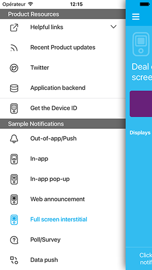
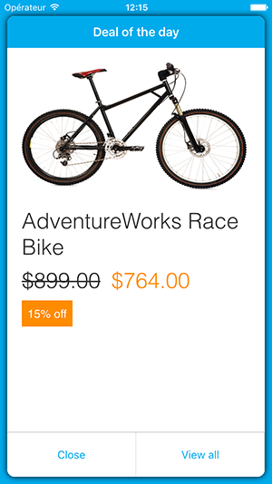

# Azure Mobile Engagement iOS App

The iOS Azure Mobile Engagement application.

Increase app usage and user retention with Azure Mobile Engagement.

- Collect real-time analytics that highlight users’ behavior
- Measure and act on analytics using single dashboard
- Create dynamic segments based on collected data
- Create marketing campaigns/push notifications targeting specific segments
- Send personalized out-of-app notifications, polls, and in-app notifications with rich HTML
- Integrate and automate with CRM/CMS/IT systems using open-platform APIs
- Find SDKs for all major platforms: iOS, Android, Windows Universal, Windows Phone, Xamarin, Cordova, Unity 

 

*Screenshots from the AzME iOS project.*

## Test the App

### Requirements

- Cocoapods : See https://cocoapods.org/
- Xcode 7.2.1, the app is written in Swift 2

### Installation 

- The project uses Cocoapods, so start to make a `pod install` to configure dependencies and workspace

From the root folder : 

```
pod install
```
- Next, open the `Engagement.workspace`

- Test locally the emulation of the SDK or create your own AzME campaigns to test push notification, Web Announcement, Poll or Data Push. Keep in mind that you have to set up same categories as specified in `Code/Utils/Config.swift#AzMESDK struct`

```
    static let interstitialCategory = "INTERSTITIAL"
    static let webAnnouncementCategory = "WEB_ANNOUNCEMENT"
    static let popUpCategory = "POP-UP"
```

### Run the app : use your own AzME Endpoint 

To test the SDK and AzME Platform, configure your Endpoint in `Code/Utils/Config.swift#AzMESDK struct`

```
    #if DEBUG
    static let endPoint =  "Your_Development_Endpoint"
    #else
    static let endPoint =  "Your_Pre-Production_Endpoint"
    #endif
```
You have to configure an Endpoint otherwise you cannot test the app correctly with the SDK. You also have to create an APNS Certificate to test the app (so change the bundle ID).

## Documentation

Official documentation is available on [Azure Mobile Engagement Website](https://azure.microsoft.com/en-us/documentation/services/mobile-engagement/)

## License : MIT

Azure Mobile Engagement App
Copyright (c) Microsoft Corporation

All rights reserved. 

MIT License

Permission is hereby granted, free of charge, to any person obtaining a copy of this software and associated documentation files (the ""Software""), to deal in the Software without restriction, including without limitation the rights to use, copy, modify, merge, publish, distribute, sublicense, and/or sell copies of the Software, and to permit persons to whom the Software is furnished to do so, subject to the following conditions:
The above copyright notice and this permission notice shall be included in all copies or substantial portions of the Software.

THE SOFTWARE IS PROVIDED *AS IS*, WITHOUT WARRANTY OF ANY KIND, EXPRESS OR IMPLIED, INCLUDING BUT NOT LIMITED TO THE WARRANTIES OF MERCHANTABILITY, FITNESS FOR A PARTICULAR PURPOSE AND NONINFRINGEMENT. IN NO EVENT SHALL THE AUTHORS OR COPYRIGHT HOLDERS BE LIABLE FOR ANY CLAIM, DAMAGES OR OTHER LIABILITY, WHETHER IN AN ACTION OF CONTRACT, TORT OR OTHERWISE, ARISING FROM, OUT OF OR IN CONNECTION WITH THE SOFTWARE OR THE USE OR OTHER DEALINGS IN THE SOFTWARE.
